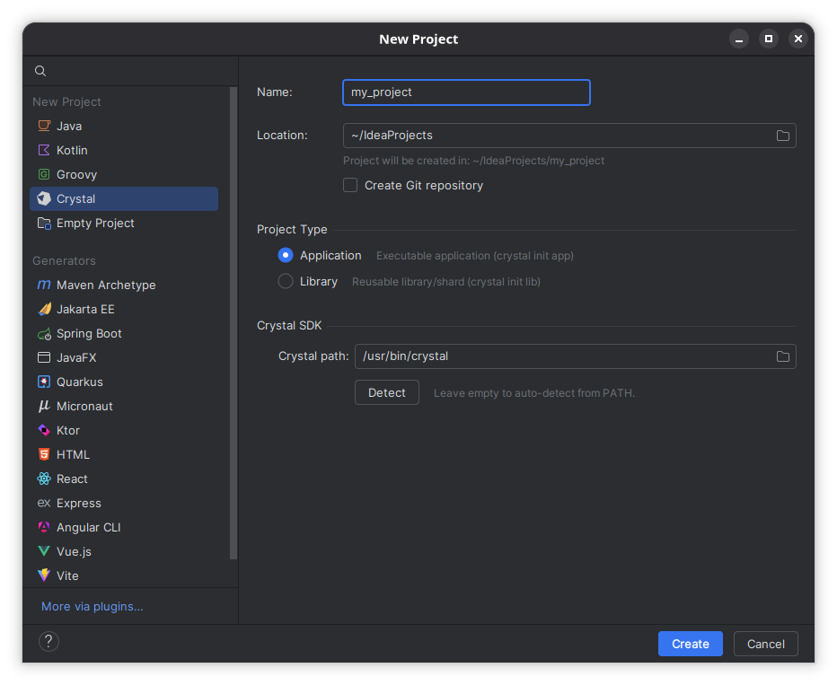
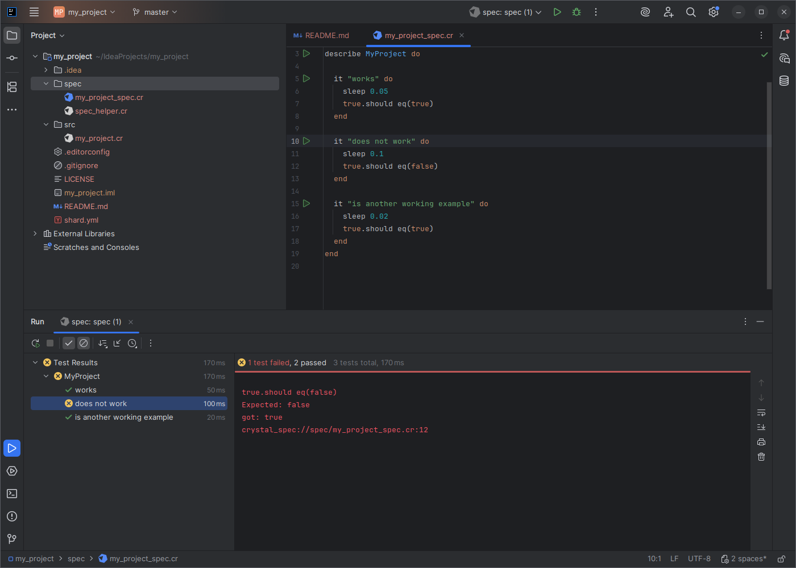
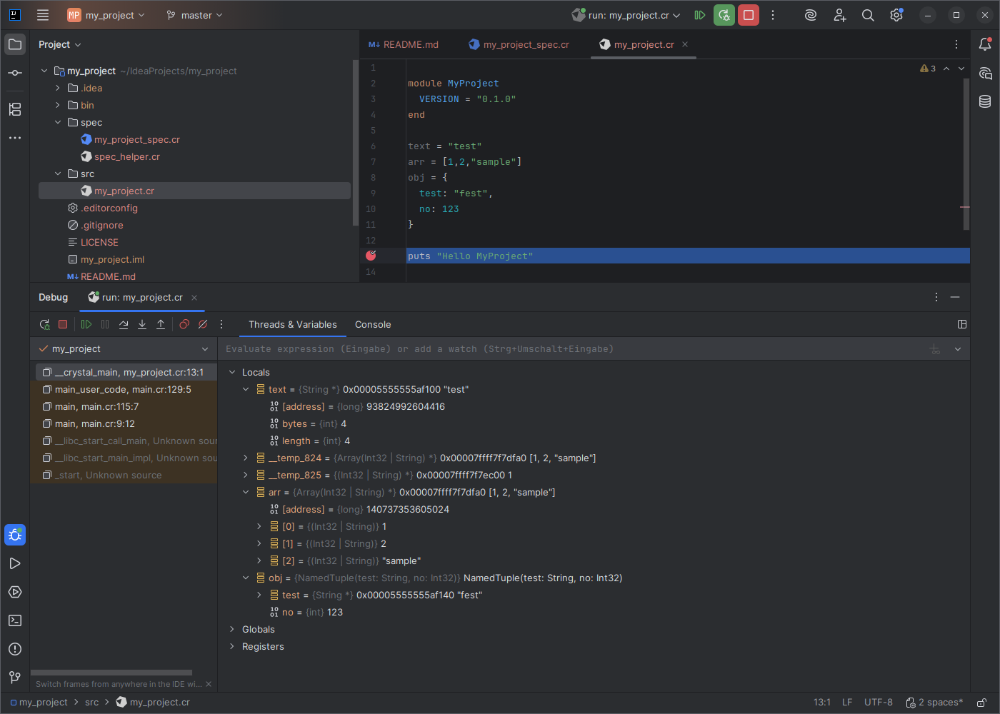

<p align="center">
  
</p>

# Crystal Language Plugin for JetBrains IDEs

[](https://plugins.jetbrains.com/plugin/32180-crystal-language)
[](https://plugins.jetbrains.com/docs/intellij/build-number-ranges.html)
[](https://crystal-lang.org)
[](LICENSE)

Crystal language support for IntelliJ IDEA, WebStorm, RubyMine, and other JetBrains IDEs.

> [!WARNING]
> Early Beta — This plugin is in active development. Bugs are to be expected.
> Please [open an issue](https://github.com/magynhard/intellij-crystal/issues/new/choose)
> and fill out the template carefully (current/expected examples are required)
> so we can triage effectively.








## Features

### Syntax & Editing

- **Syntax Highlighting** — 60+ keywords, operators, strings with interpolation, numbers, symbols, regex, percent literals, heredocs, annotations, macros
- **Semantic Highlighting** — PSI-based annotator distinguishes variables, methods, types, parameters, and macro fresh vars
- **Keyword Block Highlighting** — cursor on `if`, `else`, `elsif`, `end`, `begin`, `rescue`, `ensure`, `case`, `when`, `def`, `class`, `module` etc. highlights all related structural keywords of the enclosing block
- **Color Settings Page** — customizable colors for all token types
- **Code Folding** — collapse blocks, methods, classes, multi-line comments, arrays, hashes
- **Brace Matching** — parentheses, brackets, braces, percent literal delimiters, `do`/`end` pairs
- **Auto-Insert** — automatic closing quotes, brackets, `end` after block keywords, auto-indentation after block openers
- **Line Commenter** — toggle `#` comments
- **Postfix Control Flow** — parser recognizes `expr if condition`, `expr unless condition`, `expr while condition`
- **TODO/FIXME Indexing** — highlights and indexes task comments

### Navigation

- **Go to Definition** (Ctrl+Click / Ctrl+B) — jump to class, module, struct, enum, method definitions, instance/class variable declarations (`@name`, `@@name`), and DOT-call methods (`obj.method`, `Class.method`)
- **Namespace Access** — hovering and Go to Definition for intermediate namespace segments (e.g. `Inner` in `Outer::Inner.method`)
- **Go to Symbol** (Ctrl+Alt+Shift+N) — find any symbol in the project
- **Go to Class** (Ctrl+N) — find classes, modules, structs, enums, aliases, annotations, and libs
- **Find Usages** (Alt+F7) — find all usages of methods, classes, instance variables (`@name`), and class variables (`@@name`) within the enclosing class
- **Structure View** — PSI-based tree with nested types, methods, macros, constants
- **Embedded Crystal (ECR) Templates** — `.ecr` and `.html.ecr` files with full template language support:
  - `<% %>` tag parsing with Crystal syntax highlighting inside tags, HTML highlighting outside
  - **Full Crystal code intelligence inside `<% %>` tags** — code completion, Go to Definition, Parameter Info, hover, Find Usages, and inspections work inside ECR tags via language injection
  - 3-section Structure View: ECR tag snippets, HTML element tree, Crystal `@instance_variables` with navigation
  - `<%>` file icon, HTML code folding, `LayeredLexerEditorHighlighter` with Crystal + HTML layers
- **Parameter Info** (Ctrl+P) — shows method signature at call site for parenthesized calls, bare calls, DOT-calls, `ClassName.new(...)`, and overloads; project-wide via StubIndex
- **Quick Documentation** (Ctrl+Q) — rendered doc comments with syntax-highlighted signature and Markdown support; clicking type names navigates to their documentation
- **Hover Type Info** — hovering over a variable shows the inferred type in a two-line popup (`String (Variable)` / `my_variable`), including local variables, instance variables, and method arguments; method return types inferred from body when no annotation exists
- **Parameter Hover** — hovering over a parameter name shows a parameter-specific popup with type (hyperlinked) and name
- **Definition Hover** — hovering over a definition name (e.g. `def butter`) shows the documentation popup

### Code Completion

- **Context-aware completion** (Ctrl+Space) — dot-completion on classes (static methods) and variables (instance methods via type inference), free-text completion for classes/methods/locals/stdlib types, type completion after `:` in annotations, inside generics (`Array(<caret>)`), and in union types (`String | <caret>`)
- **Overloaded methods** — multiple overloads of the same method appear as separate entries, each showing its parameter signature
- **Record macro completion** — completion, parameter info, and argument inspections for record macros
- **Auto-completion for `::`** — typing `::` after a CONSTANT triggers the completion popup automatically
- **Parameter priority boost** — parameters appear higher in the completion popup with bold styling

### Refactoring

- **Rename** (Shift+F6) — in-place rename with preview dialog and automatic compiler verification (`crystal build --no-codegen`)
- **Names Validator** — validates Crystal identifier rules (including `?` and `!` suffixes)

### Code Formatting

- **Reformat Code** (Ctrl+Alt+L) — delegates to `crystal tool format` via stdin/stdout
- No configuration needed — Crystal's formatter has no options

### Run & Debug

- **Run Configurations** — crystal run, build, and spec with configurable arguments, environment variables, and working directory
- **Debugger** — breakpoints, variable inspection, and stepping via lldb-dap (DAP protocol)
- **Test Runner** — integrated spec runner with gutter icons, single-test execution, and result tree
- **Context-aware** — right-click a `.cr` file to run it

### Code Generation

- **Live Templates** — 21 snippets for common Crystal patterns (class, module, struct, def, spec, etc.)

### Inspections

- **Type checking** — validates argument types against parameter annotations (supports numeric autocasting, union types, nilable types, overloads)
- **Argument count** — validates number of arguments against method signature (supports named args, splat, double-splat, default values)
- **Unused variables** — reports assigned-but-never-read local variables
- **Empty collection literals** — reports `[] of T` / `{} of K => V` style issues
- **Missing type in lib fun** — reports parameters without type annotations in lib fun definitions
- **Colon spacing** — reports missing space after `:` in type annotations (e.g. `x:Int32`)
- **Instance variable type** — validates instance variable types against declarations
- **Invalid single-quote string** — reports non-ASCII characters in single-quote strings

### Parser

- **GrammarKit BNF parser** — covers classes, modules, structs, enums, methods, macros, control flow, postfix if/unless/while/until/rescue, typed declarations, expressions with operator precedence, type references with generics (variadic `*T`, defaults `T = X`), union types, blocks, literals, percent literals (`%w[]`, `%i[]`, `%x()`) with string interpolation, regex with string interpolation, backtick command literals with string interpolation, lib blocks (fun, union, struct, enum, external vars, varargs), top-level fun, wrapping operators, `previous_def`, `out` parameters, pattern matching (pin `^var`, guards), annotations on parameters, rescue in method body with typed rescue (union types, variable binding), condition assignments (`while x = expr`), metaclass types (`T.class`), backslash line continuation, method chaining across newlines, trailing commas, `&.method` shorthand with operators and bracket access (`&.[]`, `&.[1]`), `::Foo` global namespace prefix, external parameter names, command literals, `$?` global variable, range with omitted start in bracket access (`arr[..2]`, `arr[1..]`), postfix `?`/`!` after macro interpolation
- **StubIndex** — project-wide indexes for navigable declarations and symbols
- **Error-tolerant** — pin/recovery rules ensure the parser works with incomplete code while typing

## Requirements

- **IntelliJ Platform** 2026.1 or later
- **Crystal** compiler (for formatting and compiler verification)
- **LLDB DAP** (optional, for debugging) — the `lldb-dap` binary must be installed

See [Installing Dependencies](#installing-dependencies) below for OS-specific instructions.

## Installation

### Installing Dependencies

This plugin depends on the **Crystal compiler** and (optionally) the **LLDB DAP** debugger.
Both binaries must be available in your `PATH`. The plugin additionally checks
`/usr/bin/lldb-dap` and `/usr/local/bin/lldb-dap` for auto-detection.

> Planned: automatic detection of versioned binaries (e.g. `lldb-dap-22`) and a
> custom install path setting will be added in a future release.

#### Linux — Arch / Manjaro / EndeavourOS / CachyOS

```bash
sudo pacman -S crystal shards lldb
```

The `lldb` package already ships `lldb-dap`.

#### Linux — Debian / Ubuntu / Mint / Pop!_OS

Crystal (official install script):

```bash
curl -fsSL https://crystal-lang.org/install.sh | sudo bash
```

LLDB DAP — the default `lldb` package in Debian/Ubuntu repos is often too old or
does not ship `lldb-dap`. Use the official LLVM apt script for a current release:

```bash
wget https://apt.llvm.org/llvm.sh
chmod +x llvm.sh
sudo ./llvm.sh 22
sudo apt install lldb-22   # ensures lldb-dap-22 is included
```

The binary is installed as `/usr/bin/lldb-dap-22`. Either add it to your `PATH` as
`lldb-dap`, or symlink it so the plugin finds it automatically:

```bash
sudo ln -s /usr/bin/lldb-dap-22 /usr/bin/lldb-dap
```

#### Linux — Fedora / RHEL / Rocky

```bash
sudo dnf install crystal lldb
```

#### Linux — openSUSE

```bash
sudo zypper install crystal lldb
```

#### macOS

Crystal and LLVM via Homebrew (recommended):

```bash
brew install crystal llvm
```

Homebrew does not install into `/usr/local/bin/` on Apple Silicon. Either add
the LLVM `bin/` directory to your `PATH`, or create a symlink:

```bash
sudo ln -s "$(brew --prefix llvm)/bin/lldb-dap" /usr/local/bin/lldb-dap
```

The system `lldb` provided by Xcode Command Line Tools
(`xcode-select --install`) does not always include `lldb-dap`. Homebrew LLVM is
the more reliable option.

#### Windows

> Native Windows support is a work in progress. WSL2 is currently the most
> reliable option — follow the Debian/Ubuntu instructions above inside WSL.

For native installs (MSVC toolchain):

**1. Microsoft Visual C++ Build Tools**

Crystal on Windows requires the MSVC toolchain. Download the
[Visual Studio Build Tools installer](https://aka.ms/vs/17/release/vs_BuildTools.exe)
and select either:

- Workload: *Desktop development with C++*, or
- Individual component: *MSVC v143 - VS 2022 C++ x64/x86 build tools* plus
  *Windows 10 SDK* (or newer)

**2. Crystal**

Download the latest `*-msvc-*` build from the
[Crystal releases page](https://github.com/crystal-lang/crystal/releases/latest):

- `crystal-<version>-msvc-unsupported.exe` — GUI installer, adds Crystal to `PATH` automatically (recommended)
- `crystal-<version>-msvc-unsupported.zip` — portable archive

For a MinGW-w64-based alternative, see the
[official Crystal Windows guide](https://crystal-lang.org/install/on_windows/).

**3. LLDB DAP (for debugging)**

Download the latest LLVM Windows installer from the
[LLVM releases page](https://github.com/llvm/llvm-project/releases/latest):

- `LLVM-<VERSION>-win64.exe`

During installation, enable **"Add LLVM to the system PATH for all users"** so
`lldb-dap.exe` is discoverable by the plugin.

#### Verifying the installation

```bash
crystal --version
lldb-dap --help
```

If both commands work from a fresh shell, the plugin will pick up the toolchain
automatically.

### From JetBrains Marketplace

The recommended way to install:

1. In your IDE, open *Settings → Plugins → Marketplace*
2. Search for **Crystal Language**
3. Click **Install** and restart the IDE

Direct link: [Crystal Language on JetBrains Marketplace](https://plugins.jetbrains.com/plugin/32180-crystal-language)

### From Source

```bash
git clone https://github.com/magynhard/intellij-crystal.git
cd intellij-crystal
./gradlew buildPlugin
```

The plugin ZIP will be at `build/distributions/`. Install via *Settings → Plugins → Install Plugin from Disk*.

To run a development IDE instance:

```bash
./gradlew runIde
```

## Architecture

```
Crystal.flex (JFlex)     →  Lexer (tokenization, highlighting)
Crystal.bnf (GrammarKit) →  Parser (PSI tree, structure)
Stubs                    →  StubIndex (indexed declarations, navigation, completion)
```

### Design Decisions

- **All features plugin-native**: No external LSP dependency — everything works offline and instantly
- **StubIndex over FileBasedIndex**: indexed declaration lookup without runtime project-wide file scans
- **External formatter**: Crystal's built-in `crystal tool format` is canonical — no need to reimplement
- **Rename strategy**: Token-based + preview dialog + compiler verification
- **Generated files committed**: Standard convention for GrammarKit-based plugins to ensure reproducible builds

## Development

### Project Structure

```
src/main/kotlin/de/magynhard/crystal/
├── lexer/              # JFlex lexer definition + token types
├── parser/             # GrammarKit BNF grammar
├── psi/                # PSI element types and stub mixins
├── stubs/              # StubIndex infrastructure
├── highlighting/       # Syntax highlighter + color settings
├── structure/          # Structure View (PSI-based)
├── navigation/         # Go to Symbol/Class, Find Usages, Parameter Info, Go to Definition
├── formatting/         # External formatter (crystal tool format)
├── refactoring/        # Rename support + compiler verification
├── run/                # Run configurations
└── *.kt                # Core (language, file type, icons, commenter, etc.)

src/main/gen/           # Generated lexer, parser, and PSI classes (committed)
src/main/resources/     # plugin.xml, icons, live templates
src/test/               # Lexer tests + test data
```

### Build

Requires JDK 21.

```bash
./gradlew build          # Compile + tests (no distributable ZIP)
./gradlew buildPlugin    # Build installable plugin ZIP (build/distributions/)
./gradlew generateLexer  # Regenerate lexer from Crystal.flex
./gradlew generateParser # Regenerate parser from Crystal.bnf
./gradlew runIde         # Launch development IDE
```

## Contributing

Issues and pull requests are welcome! Please read [CONTRIBUTING.md](CONTRIBUTING.md)
before opening an issue — it explains the three issue types and what
information we need.

- 🐛 [Report a bug](https://github.com/magynhard/intellij-crystal/issues/new/choose) — something doesn't work as expected
- ✨ [Request a feature](https://github.com/magynhard/intellij-crystal/issues/new/choose) — a Crystal construct or IDE feature that isn't supported yet
- 🦥 [Report a UX issue](https://github.com/magynhard/intellij-crystal/issues/new/choose) — something works but feels clunky

See [CONTRIBUTING.md](CONTRIBUTING.md) for guidelines on how to report issues and contribute.

## License

MIT — see [LICENSE](LICENSE)

This project includes **Crystal LLDB Formatters** (`src/main/resources/debugger/crystal_formatters.py`)
from the [Crystal Programming Language](https://github.com/crystal-lang/crystal),
licensed under the [Apache License 2.0](https://github.com/crystal-lang/crystal/blob/master/etc/lldb/crystal_formatters.py).
