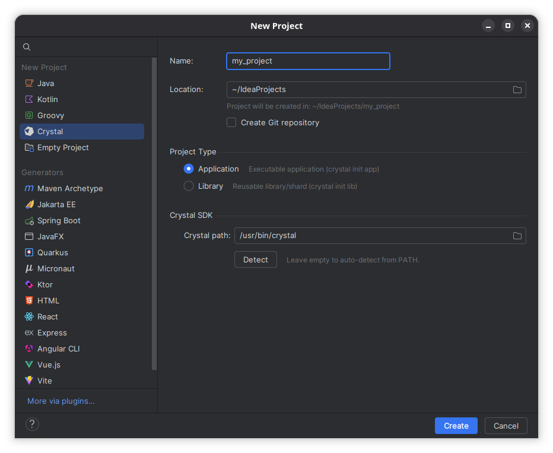

<p align="center">
  
</p>

# Crystal Language Plugin for JetBrains IDEs

[](https://plugins.jetbrains.com/plugin/32180-crystal-language)
[](https://plugins.jetbrains.com/docs/intellij/build-number-ranges.html)
[](https://crystal-lang.org)
[](LICENSE)

Crystal language support for IntelliJ IDEA, RubyMine, WebStorm, and other compatible JetBrains IDEs. The plugin provides editing, navigation, code intelligence, testing, and debugging through a native IntelliJ Platform integration without requiring a language server.

> [!WARNING]
> **Early Beta** — This plugin is under active development. Bugs and unsupported Crystal constructs are to be expected. Please [open an issue](https://github.com/magynhard/intellij-crystal/issues/new/choose) with a minimal example and the current and expected behavior.




## Highlights

### Editing

- Syntax and semantic highlighting for Crystal code, including macros, annotations, heredocs, regex, percent literals, and interpolation
- Keyword block highlighting for structures such as `if`/`elsif`/`else`/`end`, methods, types, and exception handling
- Code folding, brace matching, line comments, automatic indentation, and automatic `end` insertion
- Formatting through Crystal's canonical `crystal tool format`
- 21 live templates for common Crystal constructs
- Dedicated color settings and TODO/FIXME indexing

### Code Intelligence

- Context-aware completion for local variables, parameters, methods, constants, types, namespaces, and `require` paths
- Receiver-aware DOT completion for literals, variables, method results, collections, constructors, and supported unions
- Require-aware method visibility based on the current file, its transitive dependencies, and the configured Crystal prelude
- Go to Definition, Go to Class, Go to Symbol, Find Usages, and Structure View
- Parameter Info for parenthesized calls, bare calls, DOT calls, constructors, and overloads
- Quick Documentation with rendered Crystal doc comments, Markdown, and navigable type links
- Hover information for variables, parameters, definitions, and inferred method return types
- Rename refactoring with compiler verification

### Inspections

- Argument count and argument type validation, including named arguments, defaults, overloads, splats, and double splats
- Instance-variable type validation and unused-assignment detection
- Diagnostics for invalid empty collections, `lib fun` parameters without types, invalid single-quoted strings, and colon spacing
- Crystal-specific diagnostics for invalid dynamic `require` contexts and malformed multiline union types

The plugin's type inference supports many common literals, collections, variables, control-flow expressions, constructors, and call chains. It is intended to provide useful editor feedback, not to replace the Crystal compiler's complete type system.

### Run, Test, and Debug

- Run configurations for `crystal run`, `crystal build`, and `crystal spec`
- Configurable compiler path, arguments, environment variables, and working directory
- Integrated spec runner with gutter actions, individual test execution, and a result tree
- Debugging through `lldb-dap`, including breakpoints, stepping, variable inspection, and bundled Crystal LLDB formatters
- Context actions for running Crystal files directly

### Embedded Crystal Templates

`.ecr` and `.html.ecr` files receive Crystal highlighting inside `<% %>` tags and HTML highlighting outside them. Completion, navigation, Parameter Info, documentation, hover information, Find Usages, and inspections are available inside injected Crystal code.

ECR code intelligence currently uses the configured Crystal prelude but does not infer a compiling project or shard entrypoint. Core types and literal methods are available, while project-specific declarations may not resolve inside a template yet.

### Project Setup

- New Project Wizard for Crystal applications and libraries
- Automatic Crystal compiler detection with a configurable project-level compiler path
- Crystal version and standard-library status in the project settings
- Targeted standard-library indexing with a manual re-index action

## Requirements

- **IntelliJ Platform 2026.2 or later**
- **Crystal 1.x** for project creation, formatting, compiler-assisted checks, running, testing, debugging, and standard-library code intelligence
- **LLDB DAP** (optional) for debugging

The plugin searches `PATH` and common installation locations for the Crystal compiler. You can configure a different executable under **Settings | Languages & Frameworks | Crystal**.

For debugging, `lldb-dap` must be available as that command or installed in one of the standard locations checked by the plugin. Native Windows support is experimental and less extensively tested than Linux and macOS support.

### Installing Dependencies

#### Linux — Arch / Manjaro / EndeavourOS / CachyOS

```bash
sudo pacman -S crystal shards lldb
```

The `lldb` package includes `lldb-dap`.

#### Linux — Debian / Ubuntu / Mint / Pop!_OS

Install Crystal with the official installation script:

```bash
curl -fsSL https://crystal-lang.org/install.sh | sudo bash
```

The default `lldb` package in Debian and Ubuntu repositories may be too old or may not include `lldb-dap`. For a current LLVM release, use the official LLVM apt script:

```bash
wget https://apt.llvm.org/llvm.sh
chmod +x llvm.sh
sudo ./llvm.sh 22
sudo apt install lldb-22
```

The package installs a versioned binary such as `/usr/bin/lldb-dap-22`. The plugin currently looks for `lldb-dap`, so make the binary available under that name:

```bash
sudo ln -s /usr/bin/lldb-dap-22 /usr/bin/lldb-dap
```

#### Linux — Fedora / RHEL / Rocky

```bash
sudo dnf install crystal lldb
```

#### Linux — openSUSE

```bash
sudo zypper install crystal lldb
```

#### macOS

Install Crystal and LLVM through Homebrew:

```bash
brew install crystal llvm
```

On Apple Silicon, Homebrew does not install LLVM into `/usr/local/bin`. Add its `bin` directory to `PATH`, or create a symlink so the plugin can find `lldb-dap`:

```bash
sudo ln -s "$(brew --prefix llvm)/bin/lldb-dap" /usr/local/bin/lldb-dap
```

The LLDB installation provided by Xcode Command Line Tools does not always include `lldb-dap`; Homebrew LLVM is the more reliable option.

#### Windows

Native Windows support is experimental and requires the MSVC toolchain.

1. Install [Microsoft Visual C++ Build Tools](https://aka.ms/vs/17/release/vs_BuildTools.exe) with either the **Desktop development with C++** workload or the MSVC v143 component and a current Windows SDK.
2. Download a current MSVC build from the [Crystal releases page](https://github.com/crystal-lang/crystal/releases/latest). The `*-msvc-unsupported.exe` installer adds Crystal to `PATH` automatically; the ZIP archive provides a portable alternative.
3. Install LLVM from the [LLVM releases page](https://github.com/llvm/llvm-project/releases/latest). Enable **Add LLVM to the system PATH for all users** during installation so `lldb-dap.exe` is discoverable.

For a MinGW-w64-based Crystal installation, see the [official Crystal Windows guide](https://crystal-lang.org/install/on_windows/).

#### Verifying the Installation

```bash
crystal --version
lldb-dap --help
```

Only the Crystal command is required when you do not need debugging. If Crystal is installed outside `PATH` and the known detection locations, select its executable under **Settings | Languages & Frameworks | Crystal**.

## Installation

1. Open **Settings | Plugins | Marketplace** in your IDE.
2. Search for **Crystal Language**.
3. Install the plugin and restart the IDE.
4. Open **Settings | Languages & Frameworks | Crystal** to verify the detected compiler and standard library.

Direct link: [Crystal Language on the JetBrains Marketplace](https://plugins.jetbrains.com/plugin/32180-crystal-language)

The plugin is incompatible with the older `net.kenro.ji.jin.intellij.crystal-2` plugin. Disable or remove that plugin before installing this one.

## Known Limitations

- The plugin is an early beta; some Crystal syntax and IDE workflows remain unsupported or incomplete.
- Editor type inference is intentionally conservative and cannot reproduce every compile-time macro or type-system decision made by the Crystal compiler.
- ECR injections currently have prelude-based code intelligence without project- or shard-entrypoint context.
- Native Windows support is experimental.

Please report parser errors, false-positive inspections, missing completion, navigation problems, and uncomfortable workflows through the [issue templates](https://github.com/magynhard/intellij-crystal/issues/new/choose).

## Architecture

Code intelligence is implemented directly on the IntelliJ Platform and does not require an external LSP:

```text
Crystal.flex (JFlex)     -> Lexer and tokenization
Crystal.bnf (GrammarKit) -> Parser and PSI tree
Stub indexes             -> Project-wide declarations and navigation
PSI analysis             -> Completion, references, inspections, and type inference
```

External toolchain actions continue to use the canonical Crystal and LLVM tools: formatting delegates to `crystal tool format`, run and test configurations invoke `crystal`, and debugging uses `lldb-dap`.

## Development

The project uses Kotlin, Java, JFlex, GrammarKit, and the IntelliJ Platform SDK. JDK 25 is used by the build; Gradle can provision the toolchain automatically through Foojay.

```bash
git clone https://github.com/magynhard/intellij-crystal.git
cd intellij-crystal
./gradlew build          # Compile and run all tests
./gradlew buildPlugin    # Build the installable plugin ZIP
./gradlew runIde         # Launch a development IDE
./gradlew generateLexer  # Regenerate the Crystal lexer
./gradlew generateParser # Regenerate the Crystal parser and PSI
```

Generated lexer, parser, and PSI sources are committed for reproducible builds.

## Contributing

Issues and pull requests are welcome. Please read [CONTRIBUTING.md](CONTRIBUTING.md) before opening an issue or starting a larger change.

- [Report a bug](https://github.com/magynhard/intellij-crystal/issues/new/choose)
- [Request a feature](https://github.com/magynhard/intellij-crystal/issues/new/choose)
- [Report a UX issue](https://github.com/magynhard/intellij-crystal/issues/new/choose)

## License

MIT — see [LICENSE](LICENSE).

This project includes [Crystal LLDB Formatters](https://github.com/crystal-lang/crystal/blob/master/etc/lldb/crystal_formatters.py), licensed under the Apache License 2.0.
